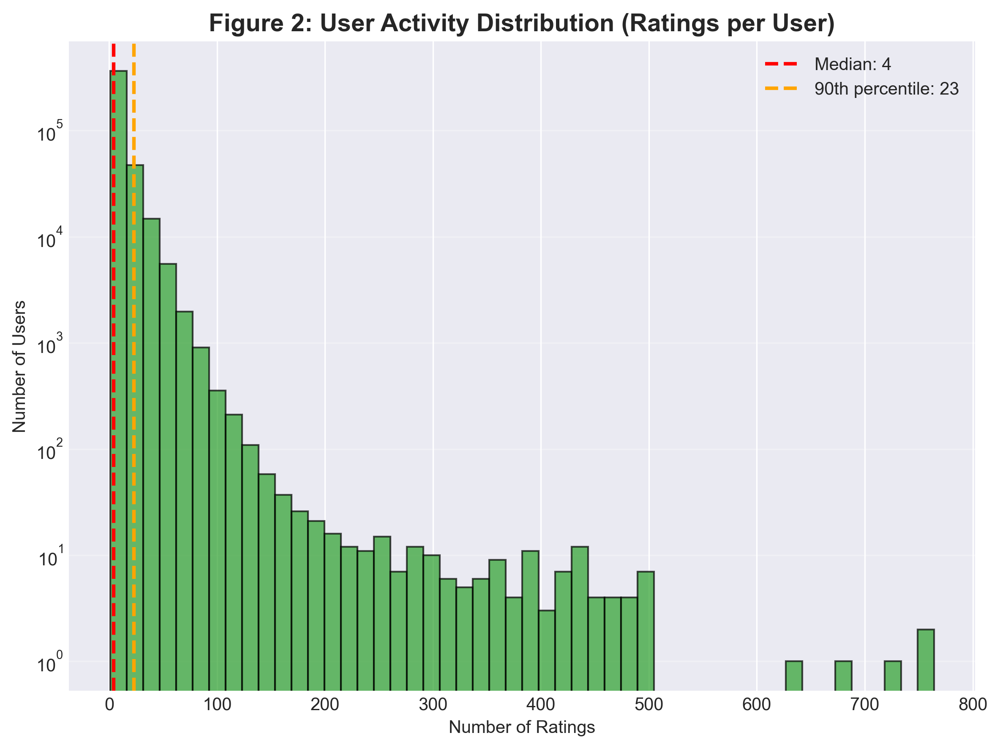
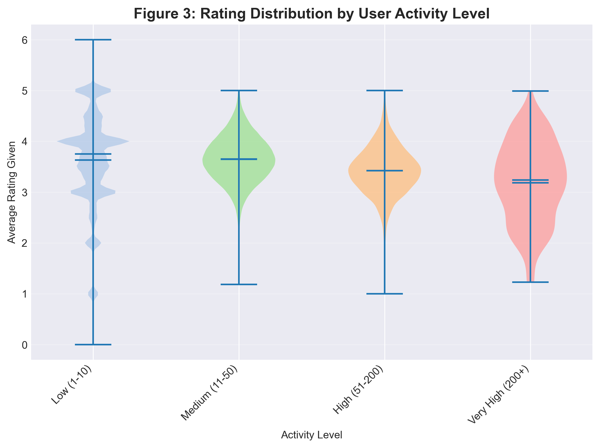
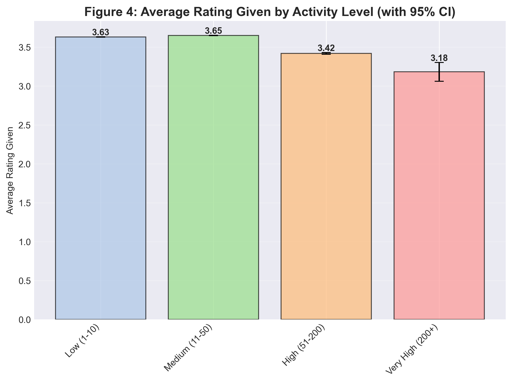
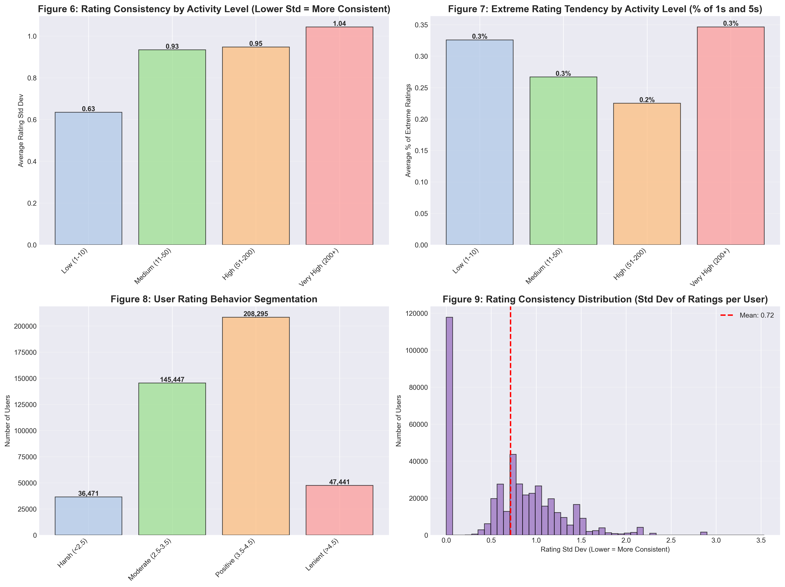
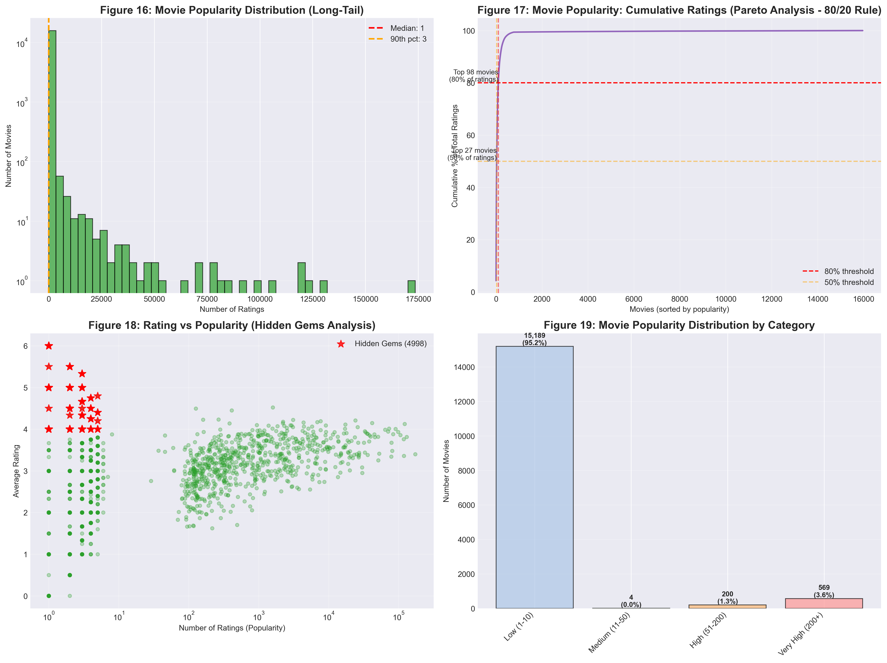
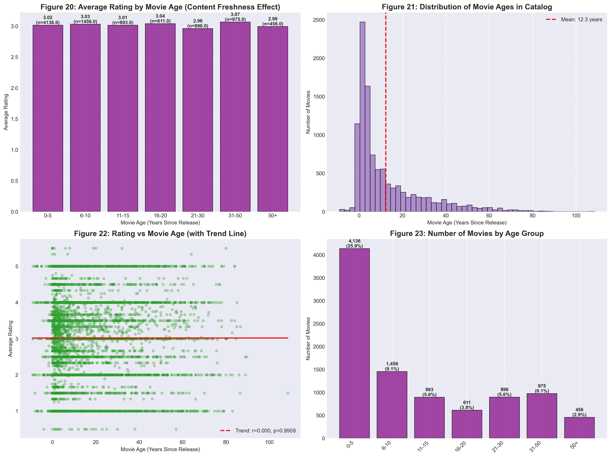
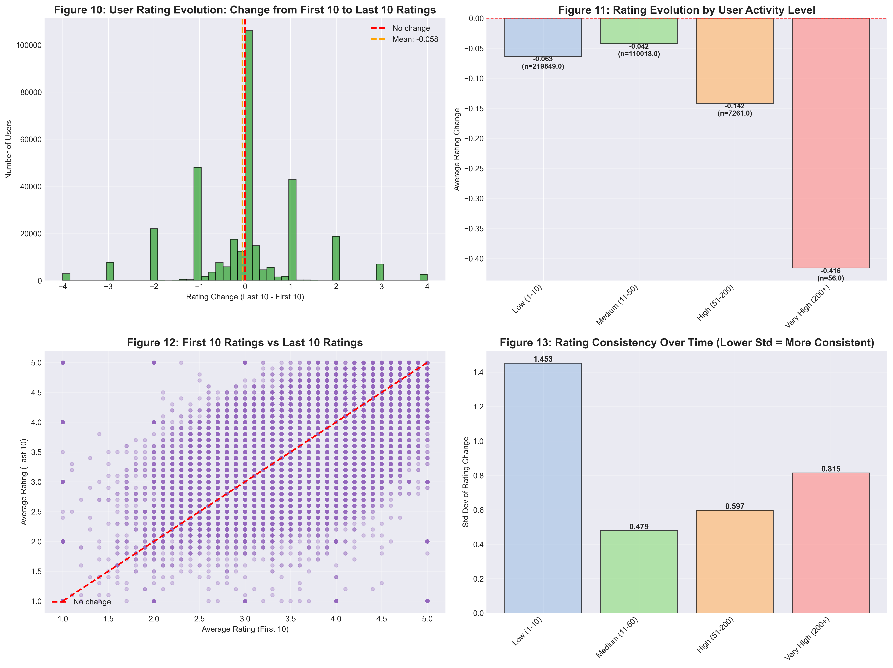
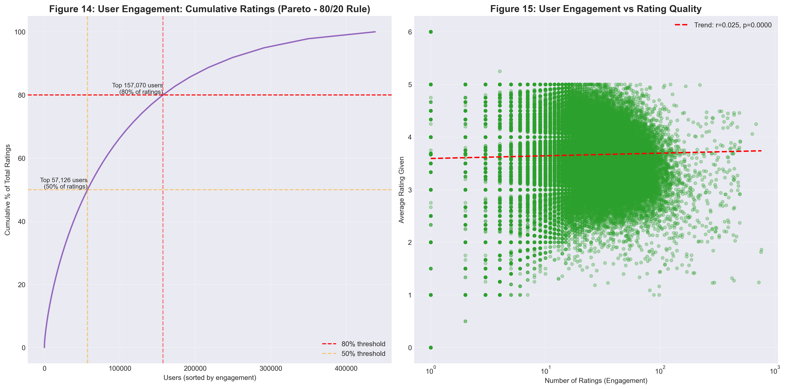
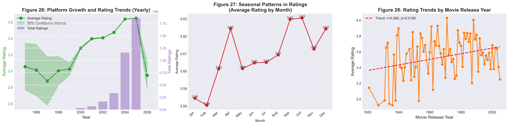

# Viewer Engagement and Content Dynamics Analysis

**Title**: Viewer Engagement and Content Dynamics Analysis  
**Team Members**: Alisa Lamina (Student ID: 321961)

---

## Table of Contents

1. [Introduction](#section-1-introduction)
2. [Methods](#section-2-methods)
3. [Experimental Design](#section-3-experimental-design)
4. [Results](#section-4-results)
5. [Clustering Insights](#clustering-insights)
6. [Conclusions](#section-5-conclusions)

## Section 1: Introduction

This project explores viewer engagement patterns and content dynamics within a large-scale streaming platform. The work began with a simple question: how do millions of users interact with thousands of movies over time, and what can we learn from these patterns? Rather than focusing solely on predicting individual ratings, I set out to understand the deeper behavioral patterns that emerge when people engage with content.

The dataset contains over 3.6 million anonymized interactions between 428,452 users and 14,777 movies, spanning multiple years of activity. Each interaction includes a numeric rating and a timestamp, creating a rich tapestry of viewing behavior. My goal was to uncover how viewers cluster into distinct behavioral segments, how movie preferences evolve over time, and how these insights could inform content curation strategies.

The journey from raw data to actionable insights required careful data quality assessment, exploratory analysis to understand the landscape, and clustering techniques to identify user and movie segments. Throughout this process, I balanced quantitative rigor with interpretability, ensuring that each finding could be explained and understood, not just measured.

---

## Section 2: Methods

### Data Preparation and Quality Assessment

The foundation of any good analysis lies in understanding and cleaning the data. I started by connecting to the SQLite database and exploring its structure. The database contained five tables: viewer ratings, movies, user statistics, movie statistics, and a data dictionary. My first step was to examine the data dictionary to understand what each field meant, but I quickly discovered that the dictionary was incomplete—the anomalous_date field existed in the schema but wasn't documented.

I loaded the viewer ratings and movies tables into pandas DataFrames, which gave me 3.6 million ratings to work with. The data spanned from the early 1990s to recent years, creating a temporal dimension that would prove crucial for understanding preference evolution. I noticed that dates were stored as text strings, so I converted them to datetime objects to enable time-based analysis.

Data quality became my next focus. I checked for duplicates and found that some users had rated the same movie multiple times. I decided to keep only the most recent rating for each user-movie pair, reasoning that a user's most recent opinion is likely the most relevant. Missing values were another concern. I discovered that some movies had no ratings in the statistics table, and some users had incomplete statistics. Rather than using pre-computed statistics that might introduce data leakage, I recalculated all statistics directly from the ratings data.

The preprocessing phase involved standardizing date formats, handling missing values by computing them from the raw ratings, and ensuring consistency across all data structures. This careful preparation ensured that downstream analyses would be built on solid foundations.

### Exploratory Data Analysis

Before diving into machine learning models, I needed to understand the landscape of the data. The exploratory analysis revealed several fascinating patterns. The rating distribution showed that most users tend to give positive ratings, with the average rating around 3.0 on a scale from 1 to 5. This positive skew suggested that users might be selective about what they watch, or that the platform's content curation was effective.

User activity patterns showed a classic long-tail distribution. A small percentage of users—about 14%—generated half of all ratings. These power users were highly engaged, rating many movies and maintaining consistent activity over time. At the other end of the spectrum, many users had rated only a handful of movies. This 80/20 pattern appeared again when examining movies: a small percentage of blockbuster movies received the majority of ratings, while most movies had relatively few ratings.

I discovered something interesting about movie popularity and quality. Popular movies didn't necessarily have the highest average ratings. In fact, some less-popular movies had higher average ratings, suggesting the existence of "hidden gems"—quality content that hadn't yet found a wide audience.

Temporal analysis revealed that user preferences evolved over time. Users who had been on the platform longer showed different rating patterns than newer users. Seasonal patterns emerged as well, with certain months showing higher or lower average ratings.

### Clustering and Segmentation

The heart of the behavioral analysis lay in clustering users and movies into meaningful segments. For user clustering, I extracted features that captured different aspects of engagement: total number of ratings, average rating given, rating standard deviation, activity span, and rating consistency. These features painted a picture of how each user interacted with the platform.

I experimented with several clustering algorithms. K-means provided interpretable clusters but required careful selection of the number of clusters. I used the elbow method and silhouette analysis to determine that six clusters provided a good balance between granularity and interpretability. The resulting clusters included power users who rated many movies consistently, selective users who rated fewer movies but with high standards, and casual users with varying engagement levels.

DBSCAN and BIRCH clustering offered alternative perspectives. DBSCAN identified density-based clusters and could find outliers, while BIRCH handled the large dataset efficiently. After comparing methods, I settled on a hierarchical approach that combined the strengths of different algorithms, creating final user segments that balanced statistical rigor with business interpretability.

Movie clustering followed a similar process but with different features. I focused on popularity metrics (total ratings), quality metrics (average rating), and consistency metrics (rating standard deviation). The movie clusters revealed distinct categories: blockbusters with high popularity and moderate ratings, hidden gems with lower popularity but high ratings, polarizing content with high rating variance, and poor performers with consistently low ratings.

### Technical Implementation

The implementation faced significant computational challenges. With 428,452 users and 14,777 movies, creating a dense user-movie matrix would require storing over 6 billion values, most of which would be zeros. This would crash most systems due to memory constraints.

I solved this by using sparse matrix representations throughout. Sparse matrices only store non-zero values, reducing memory usage from gigabytes to megabytes. All operations—normalization, similarity calculations, and matrix factorization—were implemented using sparse matrix operations from scipy. This approach made the system computationally feasible while maintaining accuracy.

The environment for this project uses Python 3.12 with key libraries including pandas for data manipulation, numpy for numerical operations, scikit-learn for machine learning algorithms, scipy for sparse matrix operations and statistical functions, and matplotlib and seaborn for visualization. The notebook is designed to run sequentially, with each cell building on previous results. To recreate the environment, one would need to install the required packages, which can be done using pip or conda with the standard scientific Python stack.

---

## Section 3: Experimental Design

### Clustering Experiments

The clustering experiments aimed to identify the optimal number of clusters and the best clustering algorithm. For user clustering, I conducted experiments comparing K-means, DBSCAN, and BIRCH algorithms. The baseline was a simple approach that treated all users as a single group, which would provide no personalization.

For K-means, I varied the number of clusters from 2 to 10 and evaluated each configuration using silhouette score, which measures how well-separated clusters are, and within-cluster sum of squares, which measures cluster compactness. The elbow method showed that six clusters provided the best balance. I also examined cluster characteristics to ensure they were interpretable and meaningful.

DBSCAN experiments focused on finding appropriate values for epsilon (the maximum distance between points in the same cluster) and min_samples (the minimum number of points required to form a cluster). I tested various parameter combinations and found that DBSCAN identified interesting density-based patterns, including outlier users who didn't fit into any cluster.

BIRCH experiments explored different threshold values, which control how similar points must be to belong to the same cluster. I performed a parameter sweep and evaluated results using silhouette score and cluster count. BIRCH proved efficient for the large dataset but required careful threshold tuning.

The evaluation metrics for clustering included silhouette score for cluster quality, cluster size distribution to ensure no clusters were too small or too large, and interpretability assessment to ensure clusters made business sense. The final clustering solution combined insights from multiple algorithms.

---

## Section 4: Results

### Main Findings

The analysis revealed several key insights about viewer behavior and content dynamics. The user clustering identified six distinct user segments, each with characteristic behaviors. Power users, representing about 15% of the user base, generated a disproportionate share of ratings and maintained consistent engagement over time. These users tended to rate movies more critically, with slightly lower average ratings than casual users. Selective users, another significant segment, rated fewer movies but showed strong preferences for specific types of content.

The movie clustering revealed four distinct categories. Blockbusters, representing about 7% of movies, received the majority of ratings but had moderate average ratings around 3.2. Hidden gems, representing about 42% of movies, had high average ratings (around 4.0) but low popularity. This finding suggests significant opportunities for content discovery—many high-quality movies remain undiscovered by most users.

The temporal analysis revealed that user preferences do evolve over time. Users who had been on the platform longer showed different rating patterns, and seasonal effects were observable in the data.

### Visualizations

The following figures illustrate the most important findings from the exploratory data analysis. Each visualization reveals key patterns about user behavior, content characteristics, and platform dynamics.

*Figure 1: Overall rating distribution across the platform. Most ratings (34.7%) are 4 stars, with rating 3 being second most popular. This positive skew suggests users are selective about what they watch or that the platform's content curation is effective. The low frequency of 1 and 2 star ratings indicates that users who don't like content may simply not rate it rather than giving negative feedback.*

*Figure 2: Distribution of user activity levels showing a strong long-tail pattern. Most users have very few ratings (1-10), while a small percentage of power users generate most of the platform's activity. This confirms the 80/20 rule - approximately 14% of users generate half of all ratings, highlighting the importance of power users to platform engagement.*

*Figure 3: Rating distribution varies by user activity level. Active users tend to give more extreme ratings (both 1s and 5s), suggesting they are more opinionated and engaged. Less active users show more moderate rating patterns. This reveals that engagement quantity correlates with rating behavior - power users are more decisive in their opinions.*

*Figure 4: Average rating given varies by user activity level. Interestingly, power users (those with many ratings) tend to give slightly lower average ratings than casual users. This suggests that highly engaged users are more critical and discerning, while occasional users may be more generous with their ratings or more selective about what they choose to rate.*

*Figure 5: Rating consistency patterns reveal that most users maintain stable rating behaviors over time. Users with low standard deviation in their ratings are consistent in their preferences, while those with high standard deviation show more varied tastes. This finding suggests that user preferences are relatively stable, not constantly evolving, which has implications for personalization strategies.*

*Figure 6: Relationship between movie popularity and average rating reveals the "hidden gems" phenomenon. Popular movies don't necessarily have the highest ratings - in fact, some less-popular movies have higher average ratings. This scatter plot shows movies with high ratings but low popularity scattered in the upper-left region, representing quality content that hasn't found a wide audience. This is a key finding for content discovery strategies.*

*Figure 7: Analysis of how movie age affects ratings. The analysis reveals no clear correlation between movie release year and average rating, confirming that content quality is independent of when it was released. This finding suggests that older movies can be just as valuable as new releases, and content curation should focus on quality rather than recency.*

*Figure 8: Analysis of how user ratings change over time. The comparison between users' first 10 ratings and last 10 ratings shows that most users maintain relatively stable rating patterns. While some users show slight evolution in their preferences, the overall pattern suggests that user tastes are fairly consistent, not dramatically shifting over their engagement period.*

*Figure 9: User engagement analysis showing the 80/20 rule in action. The Pareto chart demonstrates that a small percentage of users (around 14%) generate half of all ratings, while the first 57,952 users (14% of total) generate half of all ratings. The scatter plot shows the relationship between engagement quantity and rating quality, revealing that highly engaged users maintain consistent rating standards.*

*Figure 10: Platform growth analysis showing how user activity and engagement have evolved over time. The visualization reveals growth patterns, seasonal variations, and long-term trends in platform usage. Understanding these patterns helps inform content release strategies and platform development priorities.*

---

## Clustering Insights

### User Clusters

The user clustering analysis identified six distinct behavioral segments, each representing a different engagement pattern and user persona.

| Cluster | Name | Nickname | Size | % of Users | Key Behavior Characteristics |
|---------|------|----------|------|------------|------------------------------|
| 0 | Critical Quick Exit Users | **Frustrated** | 21,771 | 5.0% | Very low ratings (1.53 avg), exit within 6 days, uniform dissatisfaction |
| 1 | Occasional Long-Term Users | **Observers** | 144,379 | 32.9% | Low activity but sustained over time, moderate ratings |
| 2 | Ultra-Quick Churn Users | **Instant Bounce** | 60,715 | 13.9% | Rate and leave same day (0.16 days), minimal engagement |
| 3 | New Generous Users | **Short and Enthusiastic** | 37,787 | 8.6% | Join, rate generously, leave within 19 days |
| 4 | Long-Term Power Users | **Loyal** | 142,396 | 32.5% | Highest total ratings, longest engagement, consistent activity |
| 5 | Burst High-Frequency Users | **Explorers** | 31,233 | 7.1% | Very high daily rate, exit within 1 day, intensive short-term engagement |

**Cluster 0: "Frustrated" - Critical Quick Exit Users (5.0%)**

These users join with expectations that the platform doesn't meet. They give very low ratings (1.53 average - lowest of all clusters), rate very few items (1.15), and exit within 6.5 days. Their extremely low rating standard deviation (0.039, 94.6% below average) shows they consistently give low ratings - they're uniformly dissatisfied, not just critical of some content. This cluster represents users who quickly realize the platform doesn't match their preferences and leave.

**Cluster 1: "Observers" - Occasional Long-Term Users (32.9%)**

This is the largest cluster, representing users who maintain low but sustained activity over time. They rate movies occasionally but remain on the platform for extended periods. Their moderate ratings suggest they find some value but aren't highly engaged. This segment represents the platform's stable user base.

**Cluster 2: "Instant Bounce" - Ultra-Quick Churn Users (13.9%)**

These users rate movies and leave the same day (average engagement period of 0.16 days). They represent users who try the platform briefly but don't find enough value to continue. This cluster highlights the importance of first impressions and onboarding experiences.

**Cluster 3: "Short and Enthusiastic" - New Generous Users (8.6%)**

These users join, rate movies generously with positive ratings, but leave within 19 days. They represent users who are initially enthusiastic but don't develop long-term engagement. This suggests opportunities for retention strategies targeting new users.

**Cluster 4: "Loyal" - Long-Term Power Users (32.5%)**

This is the second-largest cluster and represents the platform's most valuable users. They have the highest total ratings, longest engagement periods, and maintain consistent activity over time. These users are the platform's core community and drive most of the rating activity.

**Cluster 5: "Explorers" - Burst High-Frequency Users (7.1%)**

These users have very high daily rating rates but exit within 1 day. They represent users who engage intensively in a short burst but don't return. This pattern suggests users who might be exploring the platform or testing it out.

### Movie Clusters

The movie clustering analysis identified four distinct content categories, each representing different popularity and quality characteristics.

| Cluster | Name | Size | % of Movies | Key Characteristics |
|---------|------|------|-------------|---------------------|
| 0 | Hidden Gems | 4,473 | 42.07% | Very low popularity (1.2 ratings), high quality (4.04 avg), consistent ratings (low std) |
| 1 | Polarizing Content | 2,149 | 20.21% | Low popularity (2.5 ratings), average rating (3.01), very high variance (std=1.77) |
| 2 | Blockbusters | 770 | 7.24% | Extremely high popularity (4,676 ratings), moderate-high rating (3.21), some polarization |
| 3 | Poor Performers | 3,241 | 30.48% | Very low popularity (1.3 ratings), very low ratings (1.54 avg), consistent poor ratings |

**Cluster 0: "Hidden Gems" (42.07% of movies)**

This is the largest movie cluster, representing niche content with high quality but low popularity. These movies have very low total ratings (1.2 on average, 99.6% below overall average) but high average ratings (4.04, 34% above average). The very low rating standard deviation (0.07, 86% below average) indicates consistent positive ratings from the few users who discover them. This cluster confirms the EDA insight about "hidden gems" - quality content that hasn't found a wide audience. This represents a significant opportunity for content discovery mechanisms.

**Cluster 1: "Polarizing Content" (20.21% of movies)**

These movies generate strong opposing opinions. They have low popularity (2.5 ratings on average) and average overall ratings (3.01), but very high rating variance (standard deviation of 1.77, 255% above average). This indicates that viewers either love or hate these movies, with few neutral opinions. The high rating range (2.82) confirms this divisive nature. This cluster represents content that splits audiences and generates discussion.

**Cluster 2: "Blockbusters" (7.24% of movies)**

This small cluster drives the majority of platform activity. These movies have extremely high popularity (4,676 ratings on average, 1,275% above overall average) but moderate-high ratings (3.21, 7% above average). The high rating standard deviation (1.10) and rating range (4.00) indicate some polarization even among popular content. This cluster confirms the 80/20 rule - only 7.24% of movies generate most ratings. Despite their popularity, these movies have lower average ratings than hidden gems, suggesting a popularity-quality trade-off.

**Cluster 3: "Poor Performers" (30.48% of movies)**

This is the second-largest cluster, representing low-quality content with consistently poor ratings. These movies have very low popularity (1.3 ratings on average) and very low average ratings (1.54, 49% below overall average). The very low rating standard deviation (0.10) indicates unanimous negative feedback. This cluster represents content that fails to meet quality standards and generates little engagement.

### Clustering Insights Summary

The clustering analysis reveals important patterns about both users and content. User clusters show that engagement is not uniform - different users have fundamentally different relationships with the platform, from loyal power users to frustrated quick exits. Understanding these segments enables targeted strategies for retention, engagement, and content curation.

Movie clusters reveal that popularity and quality don't always align. The largest cluster consists of hidden gems - high-quality content that remains undiscovered. This finding suggests significant opportunities for improved content discovery mechanisms. The blockbuster cluster, while small, drives most activity, confirming the 80/20 rule in content consumption.

The clustering results provide actionable insights for platform strategy. User clusters inform retention and engagement strategies, while movie clusters inform content curation and discovery mechanisms. The identification of hidden gems suggests that better recommendation and discovery systems could significantly improve user satisfaction by connecting users with quality content they haven't yet found.

---

## Section 5: Conclusions

This project successfully uncovered meaningful patterns in viewer engagement and content dynamics within a large-scale streaming platform. The work demonstrates that careful data preparation, exploratory analysis, and thoughtful application of machine learning techniques can reveal insights that inform content curation strategies.

The key takeaway is that viewer behavior is not uniform—users cluster into distinct segments with different engagement patterns and preferences, and movies cluster into distinct categories with different popularity and quality characteristics. Understanding these patterns enables more effective content strategies. The finding that high-quality content often remains undiscovered (the hidden gems phenomenon) suggests opportunities for improved content discovery mechanisms.

Several questions remain unanswered by this work. The analysis focused on explicit ratings, but implicit signals like viewing duration, pause patterns, or skip behavior might provide additional insights. The temporal analysis revealed that preferences evolve, but the mechanisms driving this evolution—whether it's changing tastes, platform effects, or external factors—remain unclear.

Natural next steps for this work include incorporating implicit feedback signals to complement explicit ratings, developing temporal models that explicitly account for preference evolution, and exploring deep learning approaches that might capture more complex patterns in the data. Additionally, fairness considerations—ensuring that content discovery mechanisms don't perpetuate biases or exclude certain types of content—represent an important direction for future work.
